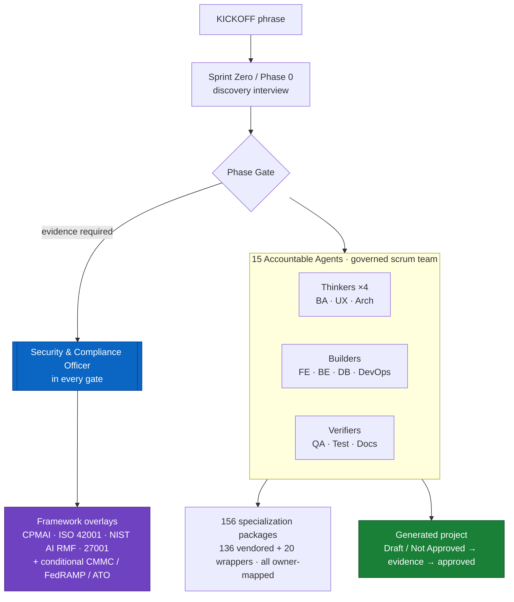

# DoW AI PM Builder Template

**A provider-agnostic template that instantiates a *governed* AI software factory — 15 accountable agents, phase-gated, with DoD-grade compliance scaffolding baked in.**

<p align="center">
  
  
  
</p>

> ### What this demonstrates
> This is a **governance-as-code blueprint for building AI software the way regulated and DoD environments require it.** Instead of bolting compliance on at the end, the template ships a 15-agent governed scrum team where a **Security & Compliance Officer sits in every phase gate**, projects start in *Draft / Not Approved* until evidence is populated, and framework mappings are explicitly fenced ("do not infer product compliance or fabricate mappings"). It's the operating model behind my thesis: **build the systems, govern the systems, defend the evidence** — turned into a reusable, validatable factory.
>
> **Bridges:** DoD/federal program execution · AI governance (CPMAI / ISO 42001 / NIST AI RMF) · security/compliance/audit · agentic GenAI orchestration · governance-as-code.
> **More:** [secondorderstrategy.com](https://secondorderstrategy.com) · author: Jerome Davis

## By the numbers

| Signal | Value |
| --- | --- |
| Governed team | **15 accountable agents** (mandatory roster) — Security & Compliance Officer in every gate |
| Specialization library | **156 capability packages** — 136 vendored (VoltAgent, 10 domains) + 20 governed execution-depth wrappers |
| Ownership mapping | **156-entry** specialization → accountable-owner map (every package has an accountable owner) |
| Governance directives | **7 governance directives** + **29 artifact templates** + **13 automation scripts** (validate, smoke-test, init, runtime-validate, gatekeeper, governed factory) |
| Default posture | Generated projects start **Draft / Not Approved** until phase-gate evidence exists |
| Framework coverage | CPMAI · ISO/IEC 42001 · NIST AI RMF · ISO/IEC 27001 (+ conditional CMMC / FedRAMP / HIPAA / SOC 2) |

## Operating model

The template creates a complete project package in a single repository: application source, governance records, decision logic, verification evidence, handoff materials, agent identities, runtime packages, and orchestration logic — all living together with clear folder boundaries. Work flows through phase gates; nothing advances to implementation until Sprint Zero discovery and gate evidence are populated.



## Factory team

- **15 accountable agents** are permanent and mandatory in the factory handoff model (rosters in `.agent/AGENT-ROSTER.md` and `.agent/souls/`).
- **Security & Compliance Officer is always installed** and participates in every phase gate.
- **156 specialization packages** — 136 vendored under `subagents/global/voltagent/` (10 domain categories) plus 20 governed execution-depth wrappers at `subagents/global/*.toml` — all mapped to accountable owners in `subagents/specialization-ownership-map.json`. They are adapted from the MIT-licensed [VoltAgent awesome-claude-code-subagents](https://github.com/VoltAgent/awesome-claude-code-subagents) collection — attribution and upstream license in `THIRD_PARTY_LICENSES.md`.
- **Root-level packages** in `subagents/global/*.toml` are 14 accountable-agent identity packages (this repo's own work, generated from `.agent/souls/`) plus 20 VoltAgent-derived execution-depth wrappers with governance metadata added — boundary detailed in `subagents/SPECIALIZATION-LIBRARY.md`.

See `.agent/AGENT-ROSTER.md` and `subagents/SPECIALIZATION-LIBRARY.md`.

## Framework applicability

| Framework | Treatment |
|---|---|
| CPMAI | Baseline lifecycle backbone for the factory |
| ISO/IEC 42001 | Baseline AIMS management-system target for factory behavior |
| NIST AI RMF | Baseline risk-function overlay |
| ISO/IEC 27001 | Crosswalk candidate when source clauses are supplied/confirmed |
| ISO/IEC 27701 | Reference Needed — Not Authoritatively Mapped |
| CMMC / FedRAMP / HIPAA / SOC 2 | Conditional product overlays only |

**Do not infer product compliance or fabricate mappings.** This guardrail is intentional: the template scaffolds the *discipline and evidence trail*, not a compliance claim.

## Governed factory runner

The factory runner is **provider-neutral**. Governance lives in repo-local automation; model execution is supplied by an adapter.

```bash
# Safe default: print the next legal governed task packet.
./automation/factory.sh

# Autonomous adapter pattern: pipe the task packet to your chosen agent CLI.
FACTORY_ADAPTER=shell \
FACTORY_ADAPTER_COMMAND='codex exec --stdin' \
./automation/factory.sh
```

Other adapters can wrap Claude Code, Gemini CLI, OpenCode, Hermes, a local model runner, or an enterprise agent runtime. The invariant is:

```text
Runtime is replaceable. Governance is not.
```

Core controls:

- `automation/governed_factory.py` selects the next legal task from `orchestration/tasks.md`.
- `automation/gatekeeper.py` enforces `.governance/gate_state.json` authority boundaries.
- `automation/run_factory.py` remains as a backward-compatible assisted wrapper.
- `factory.config.example.json` documents adapter configuration and stop conditions.

The factory's mechanisms are clause-mapped to ISO/IEC 42001 and NIST AI RMF — with evidence pointers and per-row verification commands — in [`docs/governance-frameworks/factory-control-matrix.md`](docs/governance-frameworks/factory-control-matrix.md). Every autonomous dispatch leaves the factory's own compliance record in `docs/verification/factory-runs/` — the task packet (what was authorized, under which gate state) and a run result (which detective checks ran, pass or violation). The dispatcher stops on human input, phase-gate readiness, authority boundaries, and validation failures before dispatch — and, on autonomous (shell-adapter) runs, applies **fail-closed detective stops after every dispatch**: unauthorized protected-source writes (git-audited against `.governance/gate_state.json`), missing required evidence, or a task left open each halt the loop with a violation report. Authority state ships fail-closed (all authorizations `false`); grants and violations are recorded in `.governance/security-compliance/override-register.md`.

**Known limitations (stated on purpose):** pre-dispatch action inference is keyword-based over task text — the post-dispatch git audit is the backstop for misclassified tasks; the write audit is detective, not preventive (an adapter command runs with the operator's own privileges); and evidence checks verify artifact existence, not artifact quality — that remains the phase gate's job.

## Fresh clone validation

```bash
python3 automation/validate_template.py
python3 automation/smoke_test_template.py
```

## Instantiate a project

```bash
python3 automation/init_project.py my-project /tmp
cd /tmp/my-project
python3 automation/validate_runtime.py .codex/agents/runtime-manifest.json
```

For agent/operator kickoff, use the canonical phrase in `KICKOFF.md`:

```text
Start a new project from the DoW AI PM Builder Template and begin Sprint Zero.
```

The factory should ask only for the minimum missing workspace detail, then let the Sprint Zero / Phase 0 interview collect mission, objectives, inputs, links, constraints, and authority boundaries.

Generated projects begin in **Draft / Not Approved** status. Sprint Zero discovery and phase gates must populate evidence before implementation proceeds.

## Runtime output

`.codex/agents/` is generated runtime output from `automation/install_subagents.py` and is ignored by git by default. The source of truth remains `subagents/` plus `.agent/souls/`.

## About the author

Built by **Jerome Davis** — a governance operator bridging DoD/federal program execution, security/compliance/audit, ISO 42001/27001 + NIST AI RMF, and hands-on agentic GenAI. This template is part of a portfolio demonstrating governance-as-code from agent runtime to auditor evidence.

🔗 **[secondorderstrategy.com](https://secondorderstrategy.com)** · companion projects (private during hardening; available on request): Lliam-GOV — governed AI agent · Priora — AI lifecycle governance platform
