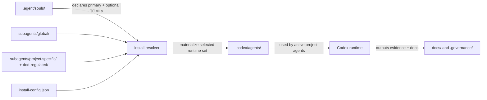

# v4 Install Contract And Target Repo Structure

## Status

Interim architecture note for [SEC-32](/SEC/issues/SEC-32), reconciled against the live repository and the local v4 master plan dated 2026-03-24.

This note is intentionally limited to Phase 0 and Phase 1 structure decisions. It does not approve broader implementation work. The required upstream system overview remains missing from `orchestration/system_spec.md`, so this document defines the packaging and activation contract only.

## Current-State Findings

- The live template is still a v3-style `.agent/` repository with 14 SOUL files and no `.codex/agents/` or `subagents/` tree.
- The canonical company workspace at `/Volumes/WORKSPACE/1-Projects` already contains a shared hidden `.agents/` root, but not project runtime agent bundles.
- The local v4 master plan assumes a new `subagents/` source tree, a generated `.codex/agents/` runtime tree, and a fifteenth SOUL: `security-compliance-officer.md`.
- Discovery inputs are incomplete:
  - `PROJECT.md` is a placeholder.
  - `orchestration/tasks.md` is generic bootstrap content.
  - `orchestration/system_spec.md` does not exist.

## Decision Summary

Use a three-layer agent packaging model:

1. `.agent/souls/` remains the source of identity, authority, phase scope, and quality gates.
2. `subagents/` becomes the template-owned catalog of installable TOML packages.
3. `.codex/agents/` becomes the generated runtime activation directory for the specific initialized project.

Do not use `.codex/agents/` as the long-term source of truth. It is a materialized runtime surface, not a library.

Do not repurpose `/Volumes/WORKSPACE/1-Projects/.agents/` for template-local TOMLs. That root should stay reserved for company-wide skills or shared operator assets that are intentionally cross-project.

## Target Structure

```text
DoW PM Builder Template/
├── .agent/
│   └── souls/
│       ├── architecture-se.md
│       ├── ...
│       └── security-compliance-officer.md
├── subagents/
│   ├── GOVERNANCE_WRAPPER.md
│   ├── install-config.json
│   ├── global/
│   ├── project-specific/
│   └── dod-regulated/
├── .codex/
│   └── agents/                 # generated at project-init time
├── directives/
│   └── agent-activation-matrix.md
├── automation/
│   └── install-subagents.sh
└── docs/architecture/
    └── ...
```

## Component Responsibilities

### `.agent/souls/`

- Durable identity and separation-of-powers definition.
- Role interface contract and approval boundaries.
- References to primary and optional TOMLs, but does not embed TOML content.

### `subagents/global/`

- Governance-wrapped TOMLs that are safe defaults across most projects.
- Installed into `.codex/agents/` for every initialized project unless explicitly excluded.
- Examples: architecture review, QA, documentation, orchestration, core development support.

### `subagents/project-specific/`

- TOMLs activated only when a project trait requires them.
- Typical triggers: language stack, cloud platform, AI/ML workload, accessibility depth, database specialization.
- Never auto-install all files in this tier.

### `subagents/dod-regulated/`

- Restricted compliance overlays for regulated workloads.
- Installed only when the project is explicitly classified as DoD/federal/regulated in project init config.
- Must include the Security & Compliance Officer support stack and related assurance specialists.

### `.codex/agents/`

- Materialized runtime set used by Codex during execution in the initialized project.
- Regenerated from `subagents/` by installer logic.
- Safe to replace during re-install because it should contain no hand-authored source material.

## Install Contract

### Inputs

- Repository-local source catalog: `subagents/`
- Role identity source: `.agent/souls/`
- Project profile file: `subagents/install-config.json`
- Optional init answers from Sprint Zero or project bootstrap

### Required profile keys

```json
{
  "project_type": "standard | ai-ml | dod-regulated | hipaa",
  "languages": ["typescript"],
  "platforms": ["web"],
  "requires_accessibility": true,
  "requires_dod_controls": false,
  "requires_iso42001": true
}
```

### Installation rules

1. Always install the baseline `global` set.
2. Add only those `project-specific` TOMLs selected by profile traits.
3. Add `dod-regulated` TOMLs only when the project profile or governance classification explicitly requires them.
4. Generate `.codex/agents/` from the resolved set.
5. Validate that every SOUL's declared primary TOML exists in `.codex/agents/`; if not, fail the install and escalate to Scrum Master.

### Runtime invariant

At execution time, a SOUL may reference only TOMLs that exist in `.codex/agents/`. Missing runtime TOMLs are an install failure, not an agent improvisation opportunity.

## Relationship To `/Volumes/WORKSPACE/1-Projects`

The canonical workspace root should govern where projects live, not how each project stores runtime agent bundles.

- `/Volumes/WORKSPACE/1-Projects/<project>/` is the canonical project location.
- `/Volumes/WORKSPACE/1-Projects/.agents/` remains the workspace-level shared asset location.
- `/Volumes/WORKSPACE/1-Projects/<project>/.codex/agents/` is the per-project runtime activation surface.
- `/Volumes/WORKSPACE/1-Projects/<project>/subagents/` is the per-template source catalog vendored with the template.

This avoids cross-project contamination and keeps regulated overlays scoped to the project that actually requires them.

## Security & Compliance Officer Decision

Add `./.agent/souls/security-compliance-officer.md` as a fifteenth SOUL, but treat it as a cross-cutting reviewer and gate participant rather than a default implementation worker.

Activation rules:

- Mandatory for `dod-regulated` projects.
- Mandatory whenever a task touches classified boundaries, authorization scope, regulated data, or formal compliance evidence.
- Advisory only for standard commercial projects unless the project profile opts in.

This role should not silently absorb Program Analyst or QA responsibilities. It reviews and blocks. It does not replace governance authorship or test execution.

## Architecture Pattern

Pattern: source-catalog plus generated-runtime overlay.

- Source catalog:
  - Human-maintained, versioned, reviewable.
  - Lives in `subagents/` and `.agent/souls/`.
- Generated runtime:
  - Machine-materialized for the initialized project.
  - Lives in `.codex/agents/`.
- Policy overlay:
  - Governance wrapper plus profile-based install rules.

This is a safer pattern than editing live TOMLs in place because it preserves provenance, enables deterministic reinstalls, and supports regulated audits.

## Dependencies

- Existing `.agent/souls/` structure in the template
- New `security-compliance-officer.md` SOUL
- New `subagents/install-config.json`
- New `automation/install-subagents.sh`
- New `directives/agent-activation-matrix.md`
- Startup protocol updates in `CODEX.md` and `CLAUDE.md`

## Non-Functional Requirements

- Determinism: repeated installs from the same config produce the same `.codex/agents/` set.
- Traceability: installed TOMLs must be attributable to source tier and profile selection.
- Isolation: regulated overlays stay project-local and do not leak into unrelated projects.
- Fail-closed behavior: missing required TOMLs or invalid profile state halts install.
- Auditability: source TOMLs remain versioned and readable independent of generated runtime output.
- Minimal operator burden: project init should require one profile selection pass, not per-agent manual copying.

## Mermaid Diagram



## Sequencing And Dependency Guidance

### Phase 0

1. Create the source-of-truth directories and config contract:
   - `subagents/`
   - `subagents/install-config.json`
   - `automation/install-subagents.sh`
2. Add `security-compliance-officer.md`.
3. Update startup docs to require TOML presence validation.

### Phase 1

1. Install only the baseline global set plus minimal regulated overlays needed for Sprint Zero.
2. Create `directives/agent-activation-matrix.md`.
3. Run a project-init dry run that proves `.codex/agents/` is generated deterministically.
4. Only after that should downstream specialists update all SOUL files or phase-gate templates.

## Explicit Blockers

- `system_spec.md -> Section A. System Overview` does not exist, so this is not a full architecture specification for downstream implementation.
- Current bootstrap docs do not define project classification inputs, so `install-config.json` schema must be approved before implementation.
- Drive folder IDs in the operator instructions did not resolve from the current `gws` session, which may block Outbox delivery unless corrected.

## Recommended Handoff

- Scrum Master: turn the sequencing section into implementation tasks with explicit owners.
- Requirements BA / Program Analyst: define the project classification inputs that drive `install-config.json`.
- Documentation SE: update README and startup docs after the install contract is accepted.
